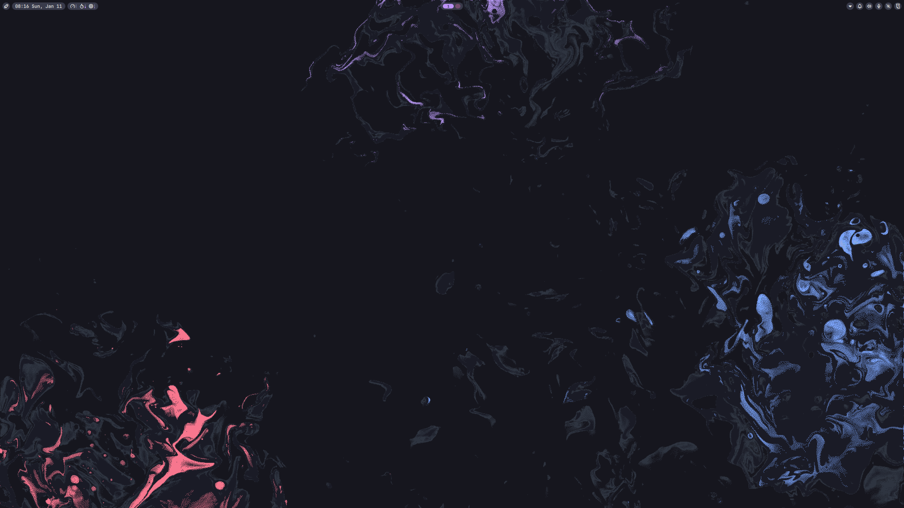

# Niri / Noctalia Configuration files

### Preview

### [Installation (ARCH)]

Get the following packages.

Niri

`yay -S niri xwayland-satellite xdg-desktop-portal-gnome xdg-desktop-portal-gtk ttf-jetbrains-mono foot`

Noctalia

`yay -S noctalia-shell matugen cava qt6-multimedia-ffmpeg`

Browser

`yay -S librewolf-bin`

EasyEffects

`yay -S easyeffects lsp-plugins`

move noctalia and niri directories inside ~/.config/

Currently noctalia uses /home/turre/ directory to look for stuff such as wallpapers etc. Change these accordingly via. noctalia or the config files.

